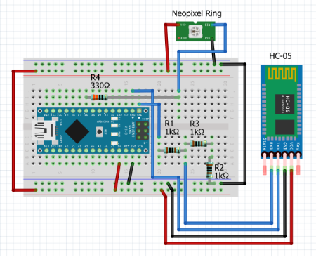
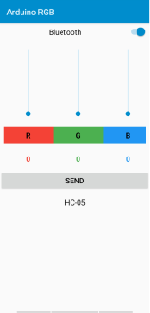
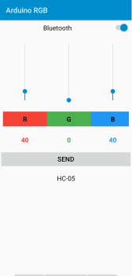

# Arduino-Bluetooth-Neopixel
Neopixel 12 LED ring is a ring of WS2812 LEDs that can be controlled using only one pin of Arduino. All the LEDs are connected in a way that each LED is individually addressable. I have developed a small Android Application that allows to control the colours of the LEDs using Bluetooth

## The Need 
This project was developed to interface an Android Application with Arduino via bluetooth and control the Neopixel LEDs.

## Requirements
Any Arduino Board, Data cable to connect Arduino with PC, 330Ω, 3 X 1k Resistors, Breadboard, Neopixel 12 LED Ring, Bluetooth Module (I have used HC-05), Connecting Wires.

## Understanding the code
We start by initializing all the required libraries
```C++
#include <Adafruit_NeoPixel.h>
#ifdef __AVR__
#include <avr/power.h> // Required for 16 MHz Adafruit Trinket
#endif
```

Then we declare the pin number and the number of LEDs we have. My Neopixel is hooked up to pin no. 6 and I am using 12 LED ring so the code says
```C++
#define PIN 6
#define NUMPIXELS 12
```

Then we start by initializing the object pixels with some required parameters and specify the delay for lighting each succesive pixel

```C++
Adafruit_NeoPixel pixels(NUMPIXELS, PIN, NEO_GRB + NEO_KHZ800);
#define DELAYVAL 120
```

We initialize some more commands and then initiate the pixels with `pixels.begin()` and we initialize the bluetooth communication at 9600 baudrate.
```C++
void setup(){
#if defined(__AVR_ATtiny85__) && (F_CPU == 16000000)
  clock_prescale_set(clock_div_1);
#endif
  pixels.begin(); // INITIALIZE NeoPixel strip object (REQUIRED)
  Serial.begin(9600);
}
```

The code checks if connection is available
```C++
if (Serial.available())
```


If available, the RGB values of each pixel are sent by Android Appication as a String and are separated, by reading until "," and are assigned to individual variables.

```C++
int r = Serial.readStringUntil(',').toInt();

int g = Serial.readStringUntil(',').toInt();

int b = Serial.readStringUntil(',').toInt();
```

Finally each pixel is set to a colour by the for loop. `pixels.setPixelColor()` is the function that takes in two parameters: pixel number and colour. The function `pixels.show()` displays the colour on the LEDs by a delay that is specified before.
An extra delay of 1 sec is used to pause the program for a short amount of time before getting the next reading
```C++
for (int i = 0; i < NUMPIXELS; i++){
pixels.setPixelColor(i, pixels.Color(r, g, b));
pixels.show();
delay(DELAYVAL);
}
delay(1000);
```

## Some snaps of the Project

<p align=center>
  
  <p align=center>Connection Diagram with Bluetooth module and Neopixel Ring</p>
</p>

<p align=center>
  
  <p align=center>Schematic Diagram</p>
</p>

<p align=center>
  
  <p align=center>Android Application</p>
</p>

<p align=center>
  
  <p align=center>Circuit in Action</p>
</p>

<p align=center>
  
  <p align=center>Android Application in Action</p>
</p>